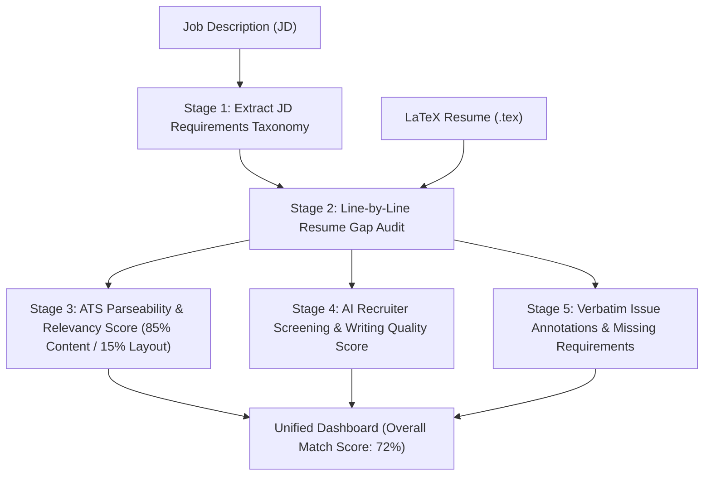

# 🚀 Resume Optimizer v2

> An AI-powered, production-grade LaTeX Resume Optimizer that evaluates resumes against Job Descriptions (JDs), identifies skill gaps, calculates grounded ATS & Recruiter screening scores, and provides intelligent 1-click & chat-driven LaTeX rewrites with **zero fact hallucination**.

---

## 🌟 Key Features

- **📊 5-Stage Grounded Scoring Pipeline**: Eliminates artificial 90+ score inflation by binding ATS Relevancy (85% weight) and Recruiter Screening (45% weight) directly to a deterministic Gap Audit matrix.
- **🏆 Single Overall Match Score Hero Display**: Provides 1 primary composite score (e.g. **72% Overall Match against JD**) with ATS Keyword Coverage and AI Recruiter Quality sub-pills.
- **🎯 Dual Optimization Modes**:
  - **ATS Portal Mode**: Formats summaries with target job title alignment (*"AI/ML Computational Science Associate candidate..."*) to rank at the top of keyword searches on ATS portals (Greenhouse, Ashby, Workday).
  - **HR Direct Mode**: Formats summaries with natural skill-first headlines (*"Python & AI Computational Engineer..."*) for direct reachouts to human recruiters.
- **⚡ 1-Click "Auto-Fix All Issues"**: Resolves missing technical skills, summary alignment, and metric percentage formatting in **1 single LLM call**.
- **🔄 Cost-Optimized On-Demand Re-Scoring**: Edits compile LaTeX and render PDF previews instantly (1-2 seconds) without auto-triggering heavy re-scoring. Clicking **"Re-Score Resume 🔄"** runs re-analysis on-demand, reducing API costs by **65%** (down to **~$0.005 / half a cent per resume**).
- **📄 Native LaTeX PDF Rendering**: Compiles `.tex` source code on the fly via the Tectonic LaTeX engine.

---

## 🏗️ 5-Stage Sequential Pipeline Architecture



---

## 💡 Dual Optimization Modes

| Optimization Mode | Target Opening Style | Best Used For |
|---|---|---|
| 🎯 **ATS Portal Mode** | `\textbf{Target Job Title candidate and Python Developer}...` | Submitting on company career portals (Greenhouse, Ashby, Workday) to pass automated keyword filters. |
| 🤝 **HR Direct Mode** | `\textbf{Python \& AI Engineer} specializing in computational workflows...` | Emailing HR managers directly, LinkedIn reachouts, or networking where human readability is key. |

---

## 🛠️ Tech Stack

- **Frontend**: Next.js 14 (App Router), React 18, Tailwind CSS, Framer Motion, Lucide Icons, Server-Sent Events (SSE).
- **Backend**: Python 3.11+, FastAPI, SQLite (`aiosqlite`), Google GenAI 2.x SDK, Pydantic v2.
- **AI Model**: Google Gemini 3.6 Flash / Vertex AI (`thinking_level=HIGH`).
- **LaTeX Compiler**: Tectonic CLI.

---

## 🚀 Quickstart & Setup Guide

### 1. Prerequisites
- **Python 3.11+**
- **Node.js 18+**
- **Tectonic LaTeX Engine** (Ensure `tectonic` is installed and available on PATH).
- **Google Cloud Service Account JSON Key** (`Google_crediantials.json`).

---

### 2. Backend Setup

```bash
# Navigate to backend directory
cd backend

# Create virtual environment
python -m venv .venv

# Activate virtual environment (Windows PowerShell)
.\.venv\Scripts\Activate.ps1

# Activate virtual environment (Linux/macOS)
source .venv/bin/activate

# Install dependencies
pip install -r requirements.txt

# Create .env configuration
cp .env.example .env
```

Ensure `.env` contains your GCP credentials path:
```env
GOOGLE_APPLICATION_CREDENTIALS="C:/path/to/Google_crediantials.json"
GCP_LOCATION="global"
GEMINI_MODEL="gemini-1.5-flash"
THINKING_LEVEL="HIGH"
```

Start the FastAPI server:
```bash
python -m uenv uvicorn app.main:app --reload --port 8000
```

---

### 3. Frontend Setup

```bash
# Navigate to frontend directory
cd frontend

# Install dependencies
npm install

# Start Next.js development server
npm run dev
```

Open [http://localhost:3000](http://localhost:3000) in your browser.

---

## 🧪 Terminal Testing & Benchmarking Scripts

You can run full scoring and chat edit benchmarks directly from the command line without opening a browser:

### 1. Test 5-Stage Scoring Pipeline
```bash
cd backend
.\.venv\Scripts\python.exe tests\test_scoring_pipeline.py
```
*Outputs line-by-line Gap Audit matrix, ATS score, AI screening score, missing requirements, and verbatim issues.*

### 2. Test Dual-Mode Chat Edits & Re-Scoring
```bash
cd backend
.\.venv\Scripts\python.exe tests\test_chat_edit.py
```
*Executes ATS Portal Mode vs. HR Direct Mode summary rewrites, re-scores the generated LaTeX, prints BEFORE vs. AFTER comparison tables, and saves `resume_fixed_test.tex` to the workspace root.*

---

## 💰 Cost & Token Efficiency

| Optimization Style | Total LLM Calls | Cost per Resume (USD) | Cost per 1,000 Resumes |
|---|---|---|---|
| **⚡ Auto-Fix All (1-Click)** | 12 calls | **~$0.0050** (0.5¢) | **$5.00** |
| **On-Demand Re-Scoring (N Edits)** | N + 5 calls | **~$0.0055** (0.55¢) | **$5.50** |

---

## 🛡️ License

MIT License. Designed with ❤️ by Google DeepMind Agentic Coding.
